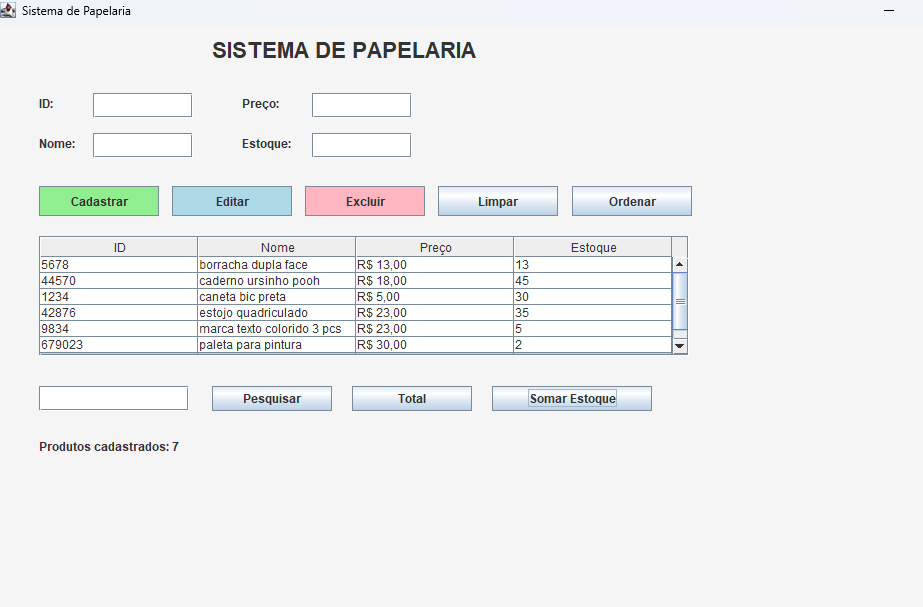
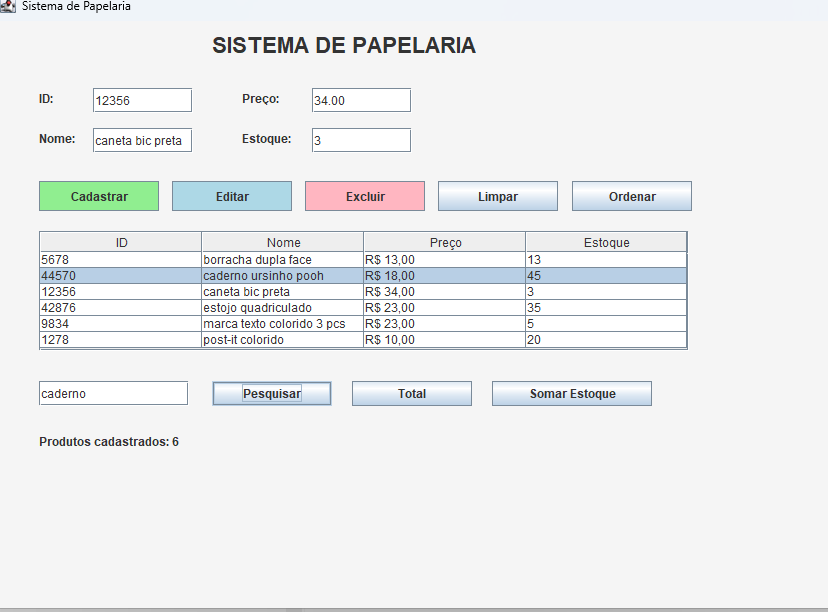
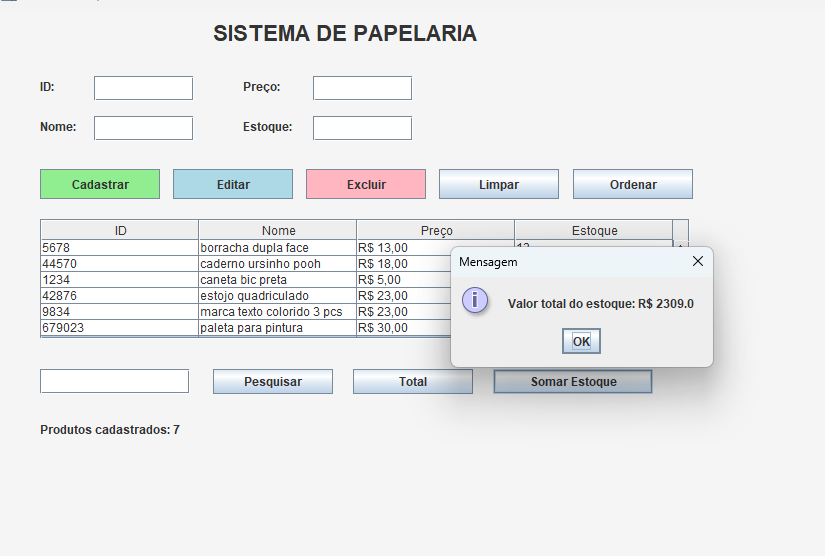
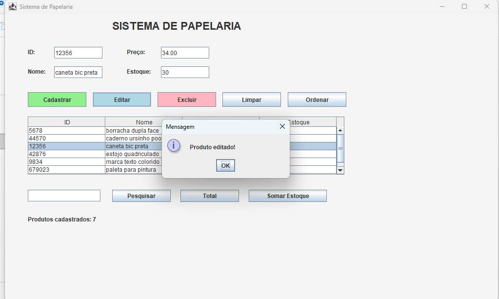

# Sistema de Gerenciamento de Papelaria (Java)

## 📌 Sobre o projeto
Este projeto é um sistema de gerenciamento de papelaria desenvolvido em Java. O sistema permite o controle de produtos por meio de cadastro, exibição e manipulação de dados.

O projeto foi estruturado de forma organizada utilizando separação de responsabilidades entre interface, regras de negócio e modelo.

---

## 🎯 Objetivo
O sistema tem como objetivo simular o gerenciamento básico de produtos em uma papelaria, facilitando o controle e organização das informações.

---

## 🛠️ Tecnologias utilizadas
- Java
- Eclipse IDE

---

## 📂 Estrutura do projeto

- Produto.java → classe modelo responsável pelos dados do produto
- TelaProduto.java → interface responsável pela interação com o usuário
- ProdutoController.java → classe responsável pela lógica e controle das operações

---

## 🧠 Organização do sistema
O projeto segue uma estrutura simples inspirada no padrão MVC:

- Model: Produto.java
- View: TelaProduto.java
- Controller: ProdutoController.java

---

Abaixo está a tela principal do sistema de papelaria:
## 🖼️ Telas do sistema

### Sistema de papelaria

### Seleção do resultado da pesquisa

### Soma de todo o estoque da papelaria

### Edição dos produtos

## 🚀 Como executar o projeto
1. Abrir o projeto no Eclipse
2. Executar a classe principal (TelaProduto.java ou outra definida como inicial)
3. Utilizar a interface para realizar as operações

---

## 👩‍💻 Autores
Sofia Alvarez (equipe do projeto)

---

## 📌 Observação
Projeto desenvolvido para fins acadêmicos.
